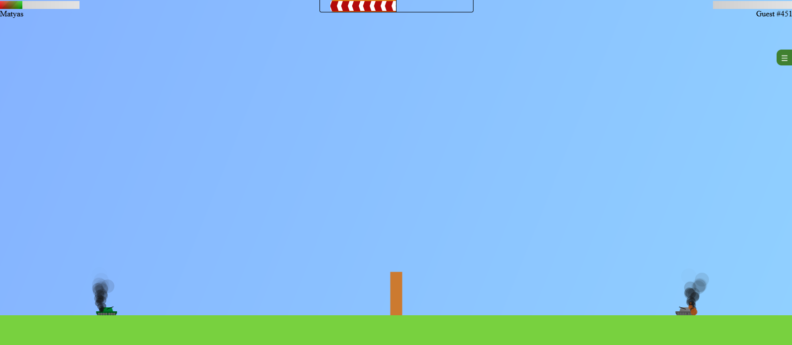
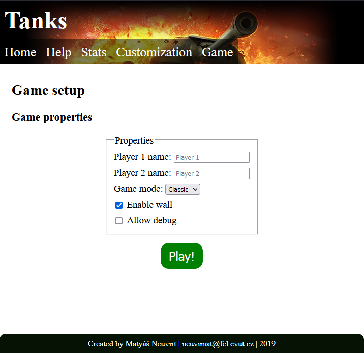

# Overview and retrospective in English

**Demo available at [https://digistruct.cz/tanks](https://digistruct.cz/tanks)**

This project was created as an assignment during my bachelor studies. To get the best possible grade, I implemented as many features from the task list as I could, thus explaining some of the seemingly 'random' additions to the app.

The project is a simple game based on the 'Worms' franchise featuring two stationary tanks trying to destroy each other.

This project is purposefully left as it was to remind myself about my journey as a programmer.

To start the project, run these commands:

    npm i
    npm run build

Then just open the index.html file at the project root. No web server required!

Except this section and the screenshots, everything in this project remains as it was when I first submitted it (including the Czech only description below).

## Screenshots

  
*In-game screenshot*

  
*Game setup*

# Tanks

## Popis
Jedná se o single page aplikaci. Hlavním pilířem je hra v canvasu, kdy po sobě střílí dva stacionární tanky. Cílem hry je zničit soupeřův tank jako první. Aby hra nebyla monotónní, střely jsou ovlivňované větrem, který se každé kolo mění, a pokud zapnuto, zdí uprostřed.

Stránka je rozdělena do dvou pohledů. Jeden "běžný", který je typická webová stránka s hlavičkou, patičkou a obsahem uprostřed. Druhý "herní", kdy je přes celou obrazovku zobrazen canvas s probíhající hrou.
## Setup
Aplikace ke svému fungování potřebuje pouze soubor index.html a obsah složky "dist", kde je pro jednoduchost již přibalený zkompilovaný JavaScript a styles.css soubor. Projekt využívá webpack.

Pro vlastní kompilaci je nutné napsat následující commandy:

    npm install // instalace webpacku a less
    npm run build // kompilace JS a less
## Spuštění
Aplikaci, pokud je spuštěná v Mozille Firefox, není nutné vystavit na vlastní webový server (localhost), stačí pouze otevřít index.html. Pro správnou funkcionalitu v Edge nebo v Chrome je lepší využití localhostu namísto file:// protokolu. V Edgi jinak nefunguje localStorage, Chrome nezobrazuje ideálně notifikace.

## Implementace
Celá aplikace je napsaná v HTML, CSS (preprocesováním LESSu) a JavaScriptu. Kromě knihovny jQuery se jedná o čistý JavaScript. Backend k aplikaci neexistuje.

## Technická omezení
I když se hlavní stránka přizpůsobí velikosti displeje, hra samotná v canvasu není na mobilních zařízení otestovaná.

Doporučená šířka prohlížeče pro nejlepší zážitek ze hry je alespoň 1366px. Na menší obrazovce jsou tanky rozmístěné blíže k sobě. Vzdálenost mezi tanky je vypočítaná pouze jednou a to při spuštění hry, měnění velikosti okna prohlížeče na rozmístění tanků se projeví až při příští hře.

## Požadavky na semestrální práci

| Požadavek                                            | Popis implementace                                                                                                                                                                   |
|------------------------------------------------------|--------------------------------------------------------------------------------------------------------------------------------------------------------------------------------------|
| Dokumentace                                          | **Ano**, právě ji čtete.                                                                                                                                                             |
| [https://validator.w3.org](https://validator.w3.org) | **Prošlo v pořádku**                                                                                                                                                                 |
| Funguje v moderních prohlížečích                     | Chrome má problém se zobrazování notifikací (protože se nejedná o https?), Edge má problém vykreslit některé elementy v canvasu barevně a s průhledností (např. exploze po výstřelu) |
| Sémantické značky                                    | **Ano**                                                                                                                                                                              |
| Grafika - SVG / Canvas                               | **Ano**, canvas.                                                                                                                                                                     |
| Média - Audio/Video                                  | **Ano**, video i audio                                                                                                                                                               |
| Formulářové prvky                                    | **Ano**, výběr nastavení během zakládání nové hry                                                                                                                                    |
| Offline aplikace                                     | **Ano**, aplikace funguje i kompletně offline (jQuery knihovna je stažena lokálně a součástí aplikace)                                                                               |
| Pokročilé selektory                                  | **Ano** (>, :hover, ::after, +, ...)                                                                                                                                                 |
| Vendor prefixy                                       | **Ne**, pouze na jednom místě u pokusu stylovat input[type=range]                                                                                                                    |
| CSS3 transformace 2D/3D                              | **Ano**, translate, rotateY, scale, ...                                                                                                                                              |
| CSS3 transitions/animations                          | **Ano**, text zobrazen během výhry/prohry je animován, transitions u tlačítek na hover, ...                                                                                          |
| Media queries                                        | **Ano**, menu v hlavičce se mění v závislosti na šířce displeje                                                                                                                      |
| OOP přístup                                          | **Ano**, ES6 classy                                                                                                                                                                  |
| Použití JS frameworku či knihovny                    | **Ano**, jQuery                                                                                                                                                                      |
| Použití pokročilých JS API                           | **Ano**, drag and drop, File API, localStorage                                                                                                                                       |
| Funkční historie                                     | **Ano**                                                                                                                                                                              |
| Ovládání medií                                       | **Ano**, na hlavní stránce video s vlastními ovládacími prvky, přehrávání zvuků během hry                                                                                            |
| Offline aplikace                                     | **Ano**, na stránce "stats" se vykresluje aktuální stav připojení k internetu                                                                                                        |
| JS práce se SVG                                      | **Ne**, místo toho aplikace hojně využívá skriptování canvasu.                                                                                                                       |

